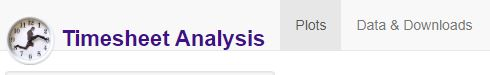
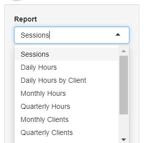
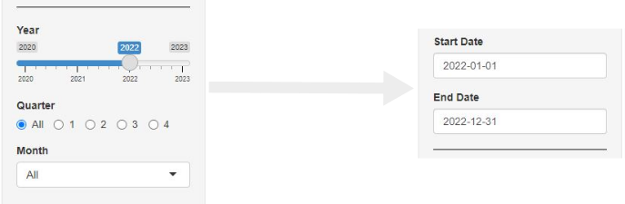
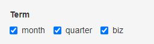
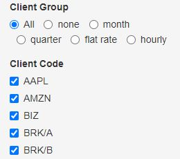
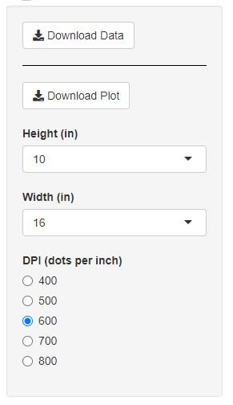

# Timesheet Analysis

## [Motivation](#motivation)

My wife owns a bookkeeping 📚 business and we found some ways for me to help her automate and analyze 📈 things.

I've been learning [shiny](https://shiny.rstudio.com/) with projects such as [this](https://bigbangdata.shinyapps.io/shinyapp/) and thought it'd be a good tool for her since downloading and running R is more user-friendly to non-programmers than the whole python 🐍🐍🐍 ecosystem and running a local app is better for security 🔐and privacy.

In `v1` of this project we used Excel as input-output to an R script. In `v2` we used Excel as input and a local shiny app as output. This public-facing `v3` of the project recreates the shiny app with fake data...

...in a reproducible and more realistic way than using a service like [mockaroo](https://www.mockaroo.com/), using R and probabilities derived from actual data. This method still has some imperfections: see [faking data](#faking-data) for limitations.

In theory🎓this app can be adapted by anyone who keeps a timesheet of any sort (hobbies, projects, exercise) and wants to see some reporting on it. In practice 👊a lot of reworking might be needed unless one's a bookkeeper with similar client breakdown and reporting needs.

See [using the app](#using-the-app) for how to use the app. [Try the app](#try-the-app) or see [reproduce the app](#reproduce-the-app) to run a local version. 💻

---

## [Demo](#demo)

---

## [Try the app](#try-the-app)

Please give [this free service](https://bigbangdata.shinyapps.io/timesheetanalysis/) a few seconds ⏳ to get up and... walking 

The app isn't super intuitive for the uninitiated... 🛐

"Initiate" by selecting an appropriate time period 📅 before selecting a report:

- `Sessions:` shorter periods for data; longer ones for plots
- `Daily Hours:` from a week to a quarter
- `Daily Hours by Client:` from a week to a month
- `Monthly Hours`: a quarter or full year
- `Quarterly Hours`: full year
- `Monthly Clients`: must select a specific month
- `Quarterly Clients`: must select a specific quarter
- `Month Report`: a quarter or full year
- `Quarter Report`: full year
- `Annual Report:` full year

---

## [Using the app](#using-the-app)

### [Overview](#app-overview)

The app has two main tabs:

__Plots tab__

There are 10 possible reports, see [details](#app-details) below for specific usage.

The `Year`, `Quarter`, and `Month` menus affect the `Start Date` and `End Date` date pickers and interact independently of each other. One must trigger an event by selecting a *different* value in one of these menus (re-selecting the same value won't affect the date pickers).

The `Term` is the billing cycle: clients pay once a month or once a quarter. The "biz" option is to look at one's own business, which does not have a term - in other words, a bookkeeper might spend time learning new tools which helps her business in general and no client or client group in particular.

`Client Group` affects the `Client Code` and helps pick specific groups such as deselecting all to pick a particular client, or picking those with a billing `Type` such as "flat rate" (a set rate paid at the start of a `Term`), or "hourly" (a variable rate paid at the end of a `Term` based on hours worked).

Again "biz" is treated as a "client" of sorts (without a rate). All other codes identify a actual paying clients. In this project I faked the codes with some Nasdaq symbols of a few companies you might have heard about in the (fake?) news.

__Data & Downloads tab__

In this tab one can view and download the data and plot selected in the `Plots` tab.

The data is downloaded as CSV and the plot as PNG with a few customizations possible, which might come in handy depending on the plot.

### [Details](#app-details)

---

## [Reproduce the app](#reproduce-the-app)

---
## [Faking data](#faking-data)

---
