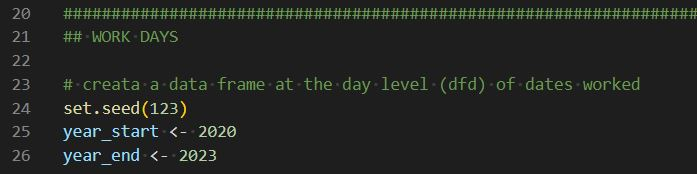
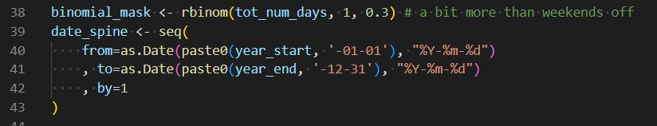
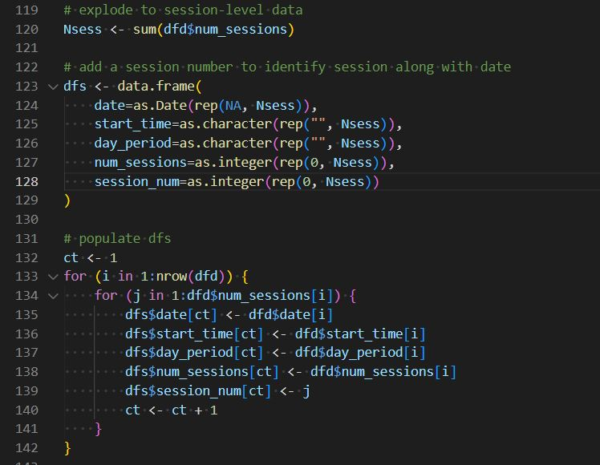
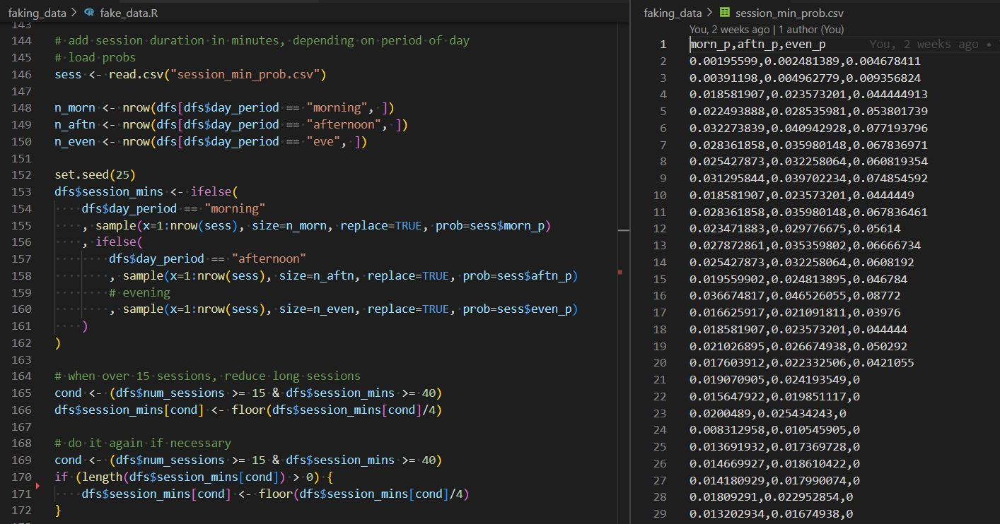

# Timesheet Analysis


## [Motivation](#motivation)

My wife owns a bookkeeping 📚 business and we found some ways for me to help her automate and analyze 📈 things.

I've been learning [shiny](https://shiny.rstudio.com/) with projects such as [this](https://bigbangdata.shinyapps.io/shinyapp/) and thought it'd be a good tool for her since downloading and running R is more user-friendly to non-programmers than the whole Python 🐍🐍🐍 ecosystem and running a local app is better for security 🔐and privacy.

In `v1` of this project we used Excel as input-output to an R script. In `v2` we used Excel as input and a local shiny app as output. This public-facing `v3` of the project recreates the shiny app with fake data...

<p align="center"></p>


...in a reproducible and more realistic way than using a service like [mockaroo](https://www.mockaroo.com/), using R and probabilities derived from actual data. This method still has some imperfections: see [faking data](#faking-data) for limitations.


In theory🎓this app can be adapted by anyone who keeps a timesheet of any sort (hobbies, projects, exercise) and wants to see some reporting on it. In practice 👊a lot of reworking might be needed unless one's a bookkeeper with similar client breakdown and reporting needs.

See [using the app](#using-the-app) for how to use the app. [Try the app](#try-the-app) or see [reproduce the app](#reproduce-the-app) to run a local version. 💻

---

## [Demo](#demo)


---

## [Try the app](#try-the-app)

Please give [this free service](https://bigbangdata.shinyapps.io/timesheetanalysis/) a few seconds ⏳ to get up and... walking 

The app isn't super intuitive for the uninitiated... 🛐

"Initiate" by selecting an appropriate time period 📅 before selecting a report:

- `Sessions:` shorter periods for data; longer ones for plots
- `Daily Hours:` from a week to a quarter
- `Daily Hours by Client:` from a week to a month
- `Monthly Hours`: a quarter or full year
- `Quarterly Hours`: full year
- `Monthly Clients`: must select a specific month
- `Quarterly Clients`: must select a specific quarter
- `Month Report`: a quarter or full year
- `Quarter Report`: full year
- `Annual Report:` full year

---

## [Using the app](#using-the-app)

### [Overview](#overview)

The app has two main tabs:
1. __Plots__ visualizes the data selected through various menu options
2. __Data & Downloads__ shows the data and a menu of download options


__Plots__

There are 10 reports, see [details](#details) below for specific usage.

<p align=center></p>

The `Year`, `Quarter`, and `Month` menus affect the `Start Date` and `End Date` date pickers and interact independently of each other. One must trigger an event by selecting a *different* value in one of these menus (re-selecting the same value won't affect the date pickers).

<p align="center"></p>

`Term` is the billing cycle: clients pay once a month or once a quarter. The "biz" option is to log unpaid activities related to the bookkeeper's business, such as learning a new niche or tool.

<p align="center"></p>

`Client Group` affects the `Client Code` and helps pick specific groups such as deselecting all to pick a particular client, or picking those with a billing `Type`.

There are two types:
- __flat rate__ -fixed rate paid at the start of a term
- __hourly__ - variable rate paid at the end of a term, based on hours worked

<p align="center"></p>

Again, "biz" is treated as a "client" of sorts. All other codes identify actual paying clients. In this project I faked the codes with some Nasdaq symbols of a few companies you might have heard about in the (fake?) news.

```
```

__Data & Downloads tab__

In this tab one can view and download the data and plot selected in the `Plots` tab.

<p align=center></p>


The data downloads as CSV and the plots as PNG with a few customizations possible, which might come in handy depending on the plot. In particular, the "Daily Hours by Client" report will only work well on the screen for a period of about two weeks, but if a month is desired one can download a long PNG using 16" height by 10" width (see [demo](#demo)).

```
```
### [Details](#details)

__1. Sessions__


Session data is unaggregated data at the level of a work session. It combines two Excel tabs (in our fake data case, two CSV files): __Clients__ and __Timesheet__.

__Clients__ is a more static, small table at the client-level:
- `code` - client code, the primary key (unique per client)
- `term` - monthly, quarterly (or biz as proxy for none)
- `type` - flat rate, hourly (or biz as proxy for none)
- `rate` - the actual payment, in dollars

As an example, if a client is quarterly and hourly (a bad choice!), the bookkeeper will be paid at the end of the quarter for all the hours worked in that quarter, given the hourly rate.

__Timesheeet__ is a more dymanic, long dataset at the session-level, containing the bookeeper's manual timesheet entries:

- `date` - the date
- `clock_in` - the start time of a work session
- `clock_out` - the end time of a work session
- `code` - the client code
- `notes` - notes related to that session
- `tags` - any tags for easier categorization of tasks


There is a variety of plots that could be made with data at this level, but the most useful we found was a boxplot comparison with a `geom_jitter` layer of dots to show not just the distribution of hours worked but also the volume of sessions for each client, given a period.

__2. Daily Hours__

The simplest aggregation simply calculates total hours worked each day and an average hours worked (in work days) for the period selected. The barplot-timeseries was a bit tricky as I wanted to capture non workdays as well. This helps with the bookkeeper's overall tracking of their hours, not specific reporting of client hours.

__3. Daily Hours by Client__

This is the solution for specific client hours and a comparison of monthly vs quarterly clients and one's own business hours. It is a panel grid where each panel is a working day. If more than 8 working days are chosen it splits into two columns of panels. This is the plot that can get overloaded with days on screen but can be downloaded in tall format if an entire month is desired.


__4. Monthly Hours__

A simple rollup of the "Daily Hours" report - it's NOT for only monthly clients, it's for all clients (including "biz").

__5. Quarterly Hours__

A simple rollup of the "Daily Hours" report - it's NOT for only quarterly clients, it's for all clients (including "biz").

__6. Monthly Clients__

This report (and the next) help the bookkeeper assess the trade-offs of keeping a client around with high volume of work for less pay per hour vs focusing on clients with a higher pay rate but less work (so less revenue).

The report is specific to monthly clients (🕵️ the name) and as such requires the user to first select a single month. It is a scatterplot of revenue by average (mean) hourly rate per client, color-coded by "hours worked" which is factored (bucketed) using quantiles.... this merits a visual:


We see that for Dec. 2022, my fake bookkeeper got the most revenue working on Nvidia's books, but that's partly because they went over the 75% quantile (5.2hs, given the period/clients) and so the mean hourly rate`*` is just slightly above average ($109.4). 

On the flipside, the best rate-per-hour that month (for monthly clients) was achieved working on Johnson & Johnson's books, but the workload was a bit light so the revenue is below the average ($411.98).

`*` which is __100% correlated__ 😅 with hours worked and the rate so we can expect to see a cone of blue clients emanating from the origin of the graph and red clients in the top-left and green clients in the bottom-right.

__7. Quarterly Clients__

Same as "Monthly Clients", for quarterly clients.

<p align="center"></p>

__8. Month Report__

Revenue and mean hourly rates for monthly clients.


__9. Quarter Report__

Revenue and mean hourly rates for quarterly clients.

__10. Annual Report__

This report almost works better in the data tab, as a multi-grain breakdown of monthly and quarterly clients with annual rollups and an annual rollup of revenue and mean hourly rate. 


The plots tab shows something that can't be easily gleaned in the data tab, which is the relative comparison for each dimension (avg. hourly rate, hours worked, revenue) and client term in each quarter. To ease the visual overload of bars I created a grid of quarters-by-quarters.


---

## [Reproduce the app](#reproduce-the-app)

To reproduce the app, clone this repo and follow these steps, which for the most part should ensure reproducibility (to reproduce or fake new data see [faking data](#faking-data) below):
1. Download R from [CRAN](https://cran.r-project.org/) for your machine and platform
2. Open R and install the following packages by issuing in the Console:

```
install.packages('dplyr')
install.packages('tidyr')
install.packages('DT')
install.packages('ggplot2')
install.packages('ggrepel')
install.packages('lubridate')
install.packages('shiny')
```

3. Set your working directory to the same directory as where you cloned this project, for ex.:

```
setwd("../Github/TimesheetAnalysis/")
```

- Tip: issue `getwd()` to find out where R runs from by default

4. Test running the app locally by loading `shiny` and running the `runApp()` command:

```
library(shiny)
runApp()
```

- Tip: stop the app with `ESC`

5. Deploy the app by installing `rsconnect` and issuing:

```
install.packages('rsconnect')
library(rsconnect)
deployApp()

```

- Tip: the app's name (url) will be the name of the folder where `app.R` is located


---
## [Faking data](#faking-data)

There are many use-cases for faking data, such as anonymizing user data for a proof-of-concept (POC) project or for user-acceptance testing (UAT) with audiences that don't have permission to access your data.

I've used [mockaroo](https://www.mockaroo.com/) and [Python's Faker package](https://github.com/joke2k/faker) before but one disadvantage was that I couldn't have a fine-grained control of the data being faked. So I created my own faker.

To merely recreate the CSV files in the `data` directory, delete those files and source the `fake_data.R` script directly from the main project directory by issuing:

```
source("faking_data/fake_data.R")
```

### Date-level Fakery

To develop new fake data start with deciding which years you want on lines 25, 26:

<p align=center></p>

The next decision is the proportion of work days to non-work days, which is set at 30% in line 38. This is a bit more than having weekends off, however, of the limitations of the script is that I decided (much like a bookkeeper I know 😉) not to limit workdays to weekdays:

<p align=center></p>

For `start times for a workday` I sampled probabilities of starting at a particular hour or minute from real data (from a year of my wife's bookkeeping timesheet). The probabilities of starting hours and minutes are a whole fascinating 🔥 topic I'm choosing not to dwell upon in this README!

The next fine-grained control was the `number of session per day`, which is highly correlated with the start times, as one can imagine. This also involved some probabilities and choices.

### Session-level Fakedom

Starting on line 119 I `explode the date-level data into session-level data`, which is implemented in a human-readable nested for loop - the reason this script is a bit slow. If I was planning on creating millions of rows I'd probably revise this using a more functional style (i.e. vectorization):

<p align=center></p>

Perhaps the most complex part is to recreate the `session durations` which are highly variable, and not go over midnight too often 🤣 - which ended up being a 3-step process of:
1. sampling durations from probabilities derived from actual data (the `session_min_prob.csv` file), given a `start period` ("morning", "afternoon", "evening")
2. reducing the length of long sessions for days with lots of sessions
3. repeating step 2 if there were still long sessions in those days

<p align=center></p>


Even after all this, I had to make sure the `date` field was representative of the `date started` and not the `date ended` work for days that might go over midnight.

### Client Fakeness

Faking client data was a lot easier and I just made up data entirely - this could've been done using mockaroo or Python's Faker or honestly, in Excel, but I wanted a reproducible and consistent way - thus the R script.

Note that there is client data in the `timesheet` as well as the `clients` "tab" of the original Excel file.

As a final note, __one major limitation of the project__ is that client rates are fixed and 1:1 with the client codes so that if a bookkeeper raised rates, she'd have to create a new code for that client. As it stands, the client code is a `client-and-rate code` of sorts. 

If you've made it this far, congratulations 🙇 and thanks for reading 🙏🏻!

<p align=center></p>

---
